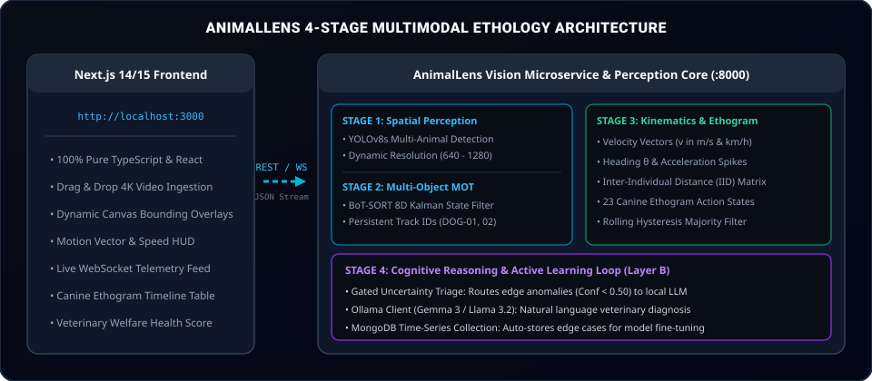
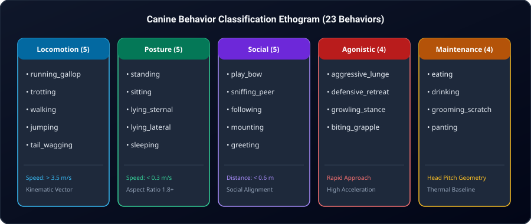

<div align="center">

# AnimalLens
### Edge AI Animal Vision and Ethology Platform for Next.js and Web Applications

[](https://nextjs.org/)
[](https://www.typescriptlang.org/)
[](https://react.dev/)
[](https://fastapi.tiangolo.com)
[](https://www.docker.com/)
[](https://opensource.org/licenses/Apache-2.0)

**AnimalLens** provides frame-accurate animal detection, multi-animal Kalman tracking, kinematic speed extraction, and ethological behavior classification directly into your **Next.js & React** web applications.

Features out-of-the-box **Canine Vision AI** (*Canis lupus familiaris*) detecting gait, speed in km/h, posture, and social interactions at **>60 FPS**.

<br/>



</div>

---

## Next.js Quickstart

Connect real-time animal vision intelligence to your Next.js application in 3 steps:

### 1. Launch the Local Edge AI Microservice

Run the local vision engine via Docker (or run locally):

```bash
docker run -d -p 8000:8000 ghcr.io/cvrvai/animallens:latest
```

*API runs at `http://localhost:8000` with interactive Swagger docs at `http://localhost:8000/docs`.*

---

### 2. Call the Inference API from Next.js (App Router)

Create an API Route in `app/api/analyze/route.ts`:

```typescript
import { NextRequest, NextResponse } from "next/server";

export async function POST(req: NextRequest) {
  const formData = await req.formData();
  const file = formData.get("file") as File;

  if (!file) {
    return NextResponse.json({ error: "No video file provided" }, { status: 400 });
  }

  // Forward to AnimalLens Edge Vision Service
  const forwardData = new FormData();
  forwardData.append("file", file);
  forwardData.append("species", "dog");
  forwardData.append("sample_fps", "10.0");

  const response = await fetch("http://localhost:8000/v1/analyze/video", {
    method: "POST",
    body: forwardData,
  });

  const data = await response.json();
  return NextResponse.json(data);
}
```

---

### 3. Display AI Detections and Behavior Telemetry in React

Use standard React components to render the analysis results:

```tsx
"use client";

import { useState } from "react";

export default function AnimalLensDashboard() {
  const [loading, setLoading] = useState(false);
  const [analysis, setAnalysis] = useState<any>(null);

  async function handleUpload(e: React.ChangeEvent<HTMLInputElement>) {
    const file = e.target.files?.[0];
    if (!file) return;

    setLoading(true);
    const formData = new FormData();
    formData.append("file", file);

    const res = await fetch("/api/analyze", { method: "POST", body: formData });
    const json = await res.json();
    setAnalysis(json);
    setLoading(false);
  }

  return (
    <div className="p-8 max-w-4xl mx-auto bg-slate-950 text-white rounded-2xl">
      <h1 className="text-2xl font-bold mb-4">AnimalLens Canine Vision AI</h1>
      <input type="file" accept="video/*" onChange={handleUpload} className="mb-6 block" />

      {loading && <p className="text-cyan-400">Processing video at &gt;60 FPS with BoT-SORT...</p>}

      {analysis && (
        <div className="space-y-4">
          <div className="p-4 bg-slate-900 border border-cyan-500/30 rounded-xl">
            <h2 className="text-lg font-semibold text-cyan-400">Identified Species</h2>
            <p className="text-xl">{analysis.species} ({analysis.taxonomy_version})</p>
          </div>

          <div className="p-4 bg-slate-900 border border-slate-800 rounded-xl">
            <h2 className="text-lg font-semibold mb-2">Behavior Timeline &amp; Kinematics</h2>
            <div className="space-y-2">
              {analysis.timeline?.map((entry: any, i: number) => (
                <div key={i} className="flex justify-between items-center bg-slate-800/50 p-2 rounded">
                  <span className="text-slate-400 font-mono">[{entry.time}s]</span>
                  <span className="font-semibold text-emerald-400">{entry.behavior}</span>
                  <span className="text-xs bg-cyan-950 text-cyan-300 px-2 py-1 rounded">
                    {(entry.confidence * 100).toFixed(0)}% Conf
                  </span>
                </div>
              ))}
            </div>
          </div>
        </div>
      )}
    </div>
  );
}
```

---

## Real-Time Live Camera Streaming (WebSockets)

For live security cameras, USB webcams, or pet monitors, connect directly over WebSockets in Next.js:

```typescript
// useAnimalLensSocket.ts
import { useEffect, useState } from "react";

export function useAnimalLensSocket() {
  const [liveEvent, setLiveEvent] = useState<any>(null);

  useEffect(() => {
    const ws = new WebSocket("ws://localhost:8000/v1/events");

    ws.onmessage = (event) => {
      const data = JSON.parse(event.data);
      if (data.type === "behavior.detected") {
        setLiveEvent(data.payload);
      }
    };

    return () => ws.close();
  }, []);

  return liveEvent;
}
```

---

## TypeScript Interface Reference

```typescript
export interface AnimalAnalysisResult {
  schema_version: string;
  species: string;
  duration_seconds: number;
  total_frames_analyzed: number;
  timeline: TimelineEntry[];
  behaviors: BehaviorEvent[];
}

export interface TimelineEntry {
  time: number;
  behavior: string;
  confidence: number;
}

export interface BehaviorEvent {
  event_id: string;
  timestamp: number;
  subjects: SubjectTelemetry[];
  behavior: {
    category: "locomotion" | "posture" | "social_behavior" | "aggression" | "maintenance";
    label: string;
    human_readable: string;
    confidence: number;
  };
  temporal: {
    start: number;
    end: number;
    duration: number;
  };
}

export interface SubjectTelemetry {
  track_id: number;
  display_id: string; // e.g. "DOG-01"
  velocity_mps: number; // Speed in m/s
  velocity_kmh: number; // Speed in km/h
  heading_degrees: number; // 0-360 orientation
  bbox: {
    x_min: number;
    y_min: number;
    x_max: number;
    y_max: number;
  };
}
```

---

## Supported Canine Behaviors and Kinematics (23 Behaviors)

<div align="center">
  
</div>

<br/>

| Category | Detected Actions | Kinematic Criteria |
| :--- | :--- | :--- |
| **Locomotion** | `running_gallop`, `trotting`, `walking`, `jumping`, `tail_wagging` | Velocity &gt; 3.5 m/s (Gallop), 1.2 - 3.5 m/s (Trot), 0.3 - 1.2 m/s (Walk) |
| **Posture** | `standing`, `sitting`, `lying_sternal`, `lying_lateral`, `sleeping` | Stationary velocity &lt; 0.3 m/s and aspect ratio geometry |
| **Social Behavior** | `play_bow`, `following`, `sniffing_conspecific`, `greeting`, `mounting` | Inter-Individual Distance (IID &lt; 0.6m) and heading alignment |
| **Agonistic** | `aggressive_lunge`, `defensive_retreat`, `growling_stance`, `biting_grapple` | Rapid approach acceleration and spatial separation |
| **Maintenance** | `eating`, `drinking`, `grooming_scratching`, `panting` | Head-down orientation and physiological baselines |

---

## Optional: Python Core Engine and Custom Model Training

For Machine Learning Engineers who want to fine-tune custom weights or run Python scripts directly:

### Install Python Library:
```bash
pip install git+https://github.com/cvrvai/AnimalLens.git
```

### Python SDK Usage:
```python
from animallens import AnimalLens

lens = AnimalLens(species="dog")
result = lens.analyze("dog_video.mp4")
print(result.format_timeline_text())
```

### Start Server via Python CLI:
```bash
animallens serve --port 8000 --device cpu
```

---

## Contributing and License

Contributions for new React components, Next.js templates, and species adapters are welcome. Please see [CONTRIBUTING.md](CONTRIBUTING.md).

Licensed under the **Apache License, Version 2.0**.
