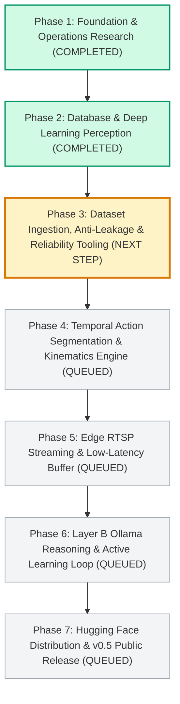

# AnimalLens Sequential Waterfall Execution Pipeline

**Project**: AnimalLens — Open Animal Behavior Intelligence Platform  
**Delivery Model**: Sequential Waterfall Flow (Strict Step-by-Step Dependency Execution)  
**Execution Rule**: Every step must be 100% completed, tested, and verified before the next step begins automatically.

---

## 1. Visual Waterfall Pipeline Diagram

---

## 2. Waterfall Stage Progression & Sequential Work Order

### Phase 1: Core Architecture, Analytics & Governance (COMPLETED)
- 1.1 **TSK-101**: Core Architecture, Pydantic Event Schemas & Layer A/B Decoupling (`commit: 7c6d4ca`)
- 1.2 **TSK-102**: Redclaw Crayfish Taxonomy Adapter (`species/redclaw/`) (`commit: 7c6d4ca`)
- 1.3 **TSK-103**: Operations Research Analytics (Markov & Clark-Evans Spatial) (`commit: ac737d7`)
- 1.4 **TSK-104**: Python SDK, Typer CLI, and FastAPI REST/WebSocket Server (`commit: 7c6d4ca`)
- 1.5 **TSK-105**: Notion-First Planning Hook & Governance Rules (`AGENTS.md`) (`commit: d3deef5`)

### Phase 2: Database & Deep Learning Perception Engine (COMPLETED)
- 2.1 **TSK-201**: MongoDB Time-Series Storage Client (`events`, `sessions`) (`commit: 1bd171d`)
- 2.2 **TSK-202**: MongoDB Aggregation Pipelines (Transitions & 24h Budgets) (`commit: 1bd171d`)
- 2.3 **TSK-203**: Active Learning Uncertainty Review Queue & Verification API (`commit: 1bd171d`)
- 2.4 **TSK-204**: Kalman Box Filter 8D State Kinematics (`kalman_filter.py`) (`commit: d23ce0a`)
- 2.5 **TSK-205**: BoT-SORT Multi-Object Tracker (`botsort_tracker.py`) (`commit: d23ce0a`)
- 2.6 **TSK-206**: YOLOv8 Object Detector Wrapper (`yolov8_detector.py`) (`commit: d23ce0a`)

### Phase 3: Dataset Ingestion, Anti-Leakage & Reliability Tooling (NEXT IN LINE)
- **3.1 TSK-301**: Anti-Leakage Dataset Splitter Engine (`animallens/datasets/partitioner.py`)
- **3.2 TSK-302**: Inter-Rater Cohen's Kappa Validator (`animallens/datasets/kappa.py`)
- **3.3 TSK-303**: Dataset Format Converter (`animallens/datasets/converter.py`)
- **3.4 TSK-304**: Dataset Management CLI (`animallens dataset split / kappa / convert`)

### Phase 4: Temporal Action Segmentation & Kinematics Engine (QUEUED)
- 4.1 **TSK-401**: Kinematic Feature Extraction (velocity profiles, IID, approach angles)
- 4.2 **TSK-402**: Multi-Frame Temporal Behavior Classifier (mating, fighting, foraging, resting)
- 4.3 **TSK-403**: Rolling Video Buffer Temporal Stride Optimizer

### Phase 5: Edge RTSP Streaming & Low-Latency Engine (QUEUED)
- 5.1 **TSK-501**: Low-Latency Live RTSP Camera Ingestion Worker
- 5.2 **TSK-502**: Real-Time WebSocket & SSE Event Broadcaster

### Phase 6: Layer B Ollama Reasoning & Active Learning Loop (QUEUED)
- 6.1 **TSK-601**: Multimodal Ollama Prompt Synthesis & Context Injector
- 6.2 **TSK-602**: Automated Uncertainty Triage & Active Learning Exporter

### Phase 7: Hugging Face Distribution & v0.5 Public Release (QUEUED)
- 7.1 **TSK-701**: Official Model Weights Packaging (`animallens/redclaw-behavior-v1`)
- 7.2 **TSK-702**: CLI Automated Model Pull from Hugging Face Hub
- 7.3 **TSK-703**: v0.5 Public Release Tag & Documentation Portal Finalization
