# AnimalLens Sequential Waterfall Execution Pipeline

**Project**: AnimalLens — Open Animal Behavior Intelligence Platform  
**Delivery Model**: Sequential Waterfall Flow (Strict Step-by-Step Dependency Execution)  
**Execution Status**: **All 12 Phases 100% Completed & Verified (73/73 Tests Passing)**

---

## 1. Visual Waterfall Pipeline Diagram

```mermaid
flowchart TD
    P1["Phase 1: Foundation & Operations Research (COMPLETED)"] --> P2["Phase 2: Database & Deep Learning Perception (COMPLETED)"]
    P2 --> P3["Phase 3: Dataset Ingestion, Anti-Leakage & Reliability Tooling (COMPLETED)"]
    P3 --> P4["Phase 4: Temporal Action Segmentation & Kinematics Engine (COMPLETED)"]
    P4 --> P5["Phase 5: Edge RTSP Streaming & Low-Latency Buffer (COMPLETED)"]
    P5 --> P6["Phase 6: Layer B Ollama Reasoning & Active Learning Loop (COMPLETED)"]
    P6 --> P7["Phase 7: Hugging Face Distribution & v0.5 Public Release (COMPLETED)"]
    P7 --> P8["Phase 8: Canine Vision AI, Multi-Dog Tracking & Next.js (COMPLETED)"]
    P8 --> P9["Phase 9: 24-Point Skeletal Pose Estimation & Biomechanics (COMPLETED)"]
    P9 --> P10["Phase 10: 1-Click Automated Model Training CLI (COMPLETED)"]
    P10 --> P11["Phase 11: Deep Metric Re-Identification (COMPLETED)"]
    P11 --> P12["Phase 12: Production Desktop & Cloud GPU Deployments (COMPLETED)"]

    style P1 fill:#d1fae5,stroke:#059669,stroke-width:2px;
    style P2 fill:#d1fae5,stroke:#059669,stroke-width:2px;
    style P3 fill:#d1fae5,stroke:#059669,stroke-width:2px;
    style P4 fill:#d1fae5,stroke:#059669,stroke-width:2px;
    style P5 fill:#d1fae5,stroke:#059669,stroke-width:2px;
    style P6 fill:#d1fae5,stroke:#059669,stroke-width:2px;
    style P7 fill:#d1fae5,stroke:#059669,stroke-width:2px;
    style P8 fill:#d1fae5,stroke:#059669,stroke-width:2px;
    style P9 fill:#d1fae5,stroke:#059669,stroke-width:2px;
    style P10 fill:#d1fae5,stroke:#059669,stroke-width:2px;
    style P11 fill:#d1fae5,stroke:#059669,stroke-width:2px;
    style P12 fill:#d1fae5,stroke:#059669,stroke-width:2px;
```

---

## 2. Waterfall Stage Progression & Verified Deliverables

### Phase 1: Core Architecture, Analytics & Governance ✅ (COMPLETED)
* 1.1 **TSK-101**: Core Architecture, Pydantic Event Schemas & Layer A/B Decoupling (`commit: 7c6d4ca`)
* 1.2 **TSK-102**: Redclaw Crayfish Taxonomy Adapter (`species/redclaw/`) (`commit: 7c6d4ca`)
* 1.3 **TSK-103**: Operations Research Analytics (Markov & Clark-Evans Spatial) (`commit: ac737d7`)
* 1.4 **TSK-104**: Python SDK, Typer CLI, and FastAPI REST/WebSocket Server (`commit: 7c6d4ca`)
* 1.5 **TSK-105**: Notion-First Planning Hook & Governance Rules (`AGENTS.md`) (`commit: d3deef5`)

### Phase 2: Database & Deep Learning Perception Engine ✅ (COMPLETED)
* 2.1 **TSK-201**: MongoDB Time-Series Storage Client (`events`, `sessions`) (`commit: 1bd171d`)
* 2.2 **TSK-202**: MongoDB Aggregation Pipelines (Transitions & 24h Budgets) (`commit: 1bd171d`)
* 2.3 **TSK-203**: Active Learning Uncertainty Review Queue & Verification API (`commit: 1bd171d`)
* 2.4 **TSK-204**: Kalman Box Filter 8D State Kinematics (`kalman_filter.py`) (`commit: d23ce0a`)
* 2.5 **TSK-205**: BoT-SORT Multi-Object Tracker (`botsort_tracker.py`) (`commit: d23ce0a`)
* 2.6 **TSK-206**: YOLOv8 Object Detector Wrapper (`yolov8_detector.py`) (`commit: d23ce0a`)

### Phase 3: Dataset Ingestion, Anti-Leakage & Reliability Tooling ✅ (COMPLETED)
* 3.1 **TSK-301**: Anti-Leakage Dataset Splitter Engine (`partitioner.py`) (`commit: a99d254`)
* 3.2 **TSK-302**: Inter-Rater Cohen's Kappa Validator (`kappa.py`) (`commit: a99d254`)
* 3.3 **TSK-303**: Dataset Format Converter (COCO / YOLOv8 / Label Studio) (`commit: a99d254`)
* 3.4 **TSK-304**: Dataset CLI Commands (`animallens dataset split / kappa`) (`commit: a99d254`)

### Phase 4: Temporal Action Segmentation & Kinematics Engine ✅ (COMPLETED)
* 4.1 **TSK-401**: Kinematic Feature Extractor (velocities, IID, approach rates) (`commit: 19f67bc`)
* 4.2 **TSK-402**: Temporal Behavior Action Classifier (`classifier.py`) (`commit: 19f67bc`)
* 4.3 **TSK-403**: Hysteresis Temporal Smoothing & Pipeline Integration (`commit: 19f67bc`)

### Phase 5: Edge RTSP Streaming & Low-Latency Engine ✅ (COMPLETED)
* 5.1 **TSK-501**: Low-Latency RTSP Stream Ingestion Worker (`sources/stream.py`) (`commit: 59486d4`)
* 5.2 **TSK-502**: Live Stream Manager & REST Streaming APIs (`/v1/stream/*`) (`commit: 59486d4`)

### Phase 6: Layer B Ollama Reasoning & Active Learning Loop ✅ (COMPLETED)
* 6.1 **TSK-601**: Multimodal Ollama Prompt Synthesis (`reasoning/prompts.py`) (`commit: 493852c`)
* 6.2 **TSK-602**: Automated Uncertainty Triage Engine (`reasoning/triage.py`) (`commit: 493852c`)

### Phase 7: Hugging Face Distribution & v0.5 Public Release ✅ (COMPLETED)
* 7.1 **TSK-701**: Hugging Face Model Hub Client & Integrity Verifier (`models/hub.py`) (`commit: 2fced43`)
* 7.2 **TSK-702**: Model Hub CLI Commands (`animallens models pull / list / verify`) (`commit: 2fced43`)
* 7.3 **TSK-703**: v0.5 Public Release Packaging (`pyproject.toml`, Version Bump) (`commit: 2fced43`)

### Phase 8: Canine Vision AI, Multi-Dog Tracking & Next.js ✅ (COMPLETED)
* 8.1 **TSK-801**: Canine Multi-Dog YOLOv8 Detection & Class Filtering (`commit: 692ae7d`)
* 8.2 **TSK-802**: BoT-SORT Telemetry Tracker (`animallens/tracking/tracker.py`) (`commit: 488f43b`)
* 8.3 **TSK-803**: Canine Ethogram Behavioral Classifier (23 Behaviors) (`commit: 488f43b`)
* 8.4 **TSK-804**: Next.js 14/15 Frontend Integration & WebSocket Feed (`commit: 843a8e4`)

### Phase 9: 24-Point Skeletal Pose Estimation & Biomechanics ✅ (COMPLETED)
* 9.1 **TSK-901**: YOLOv8-Pose Top-Down 24-Keypoint Estimator (`perception/models/yolov8_pose.py`) (`commit: c3e56c5`)
* 9.2 **TSK-902**: Joint Angle & Spine Curvature Biomechanics (`analytics/pose_kinematics.py`) (`commit: c3e56c5`)
* 9.3 **TSK-903**: Automated Gait Lameness & Asymmetry Scoring Engine (`commit: 5436e67`)
* 9.4 **TSK-904**: Next.js Canvas Skeletal Wireframe HUD Overlay & TypeScript Schemas (`commit: a6a5fd8`)

### Phase 10: 1-Click Automated Model Training CLI (`animallens train`) ✅ (COMPLETED)
* 10.1 **TSK-1001**: Automated Video Keyframe Slicer & Pseudo-Labeler (`training/dataset_builder.py`) (`commit: a6a5fd8`)
* 10.2 **TSK-1002**: Transfer Learning Pipeline with Auto-Checkpointing (`best.pt`, `last.pt`, ONNX) (`commit: a6a5fd8`)
* 10.3 **TSK-1003**: CLI Command `animallens train --video <file> --epochs 50` (`commit: a6a5fd8`)

### Phase 11: Deep Metric Re-Identification (ReID Individual Tracking) ✅ (COMPLETED)
* 11.1 **TSK-1101**: 512-Dim Visual Feature Embedding Extractor (`reid/extractor.py`) (`commit: 2a78ed3`)
* 11.2 **TSK-1102**: Persistent ReID Gallery & Multi-Camera Associator (`reid/gallery.py`) (`commit: 2a78ed3`)

### Phase 12: Production Desktop & Cloud GPU Deployments ✅ (COMPLETED)
* 12.1 **TSK-1201**: Production Docker Compose Stack with NVIDIA Container Toolkit (`commit: 6a8de2b`)
* 12.2 **TSK-1202**: Multi-Container Orchestration (Vision Microservice + MongoDB + Ollama) (`commit: 6a8de2b`)
* 12.3 **TSK-1203**: ReID Gallery & Model Training REST Endpoints (`commit: 7e0e52e`)
